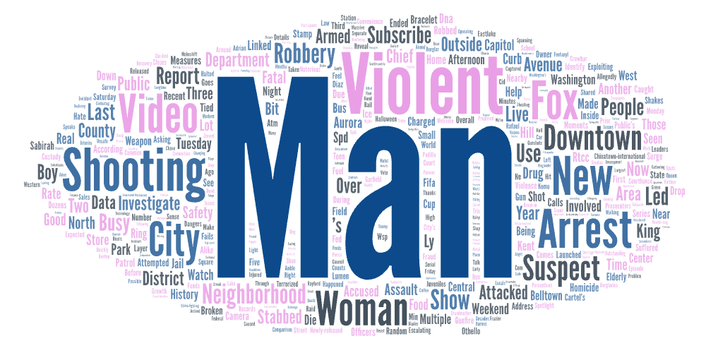

# Seattle public safety narratives on YouTube

I used a simple Selenium + BeautifulSoup crawler to collect YouTube search results for three related queries:

- **seattle crime**
- **seattle safety**
- **seattle homeless**

The idea was to see how different wording (“crime” vs “safety” vs “homeless”) changes what shows up on YouTube and what language appears in the snippets.

## What I did (in plain language)

For each search term, I opened the YouTube results page, scrolled several times to load more videos, and extracted basic fields for each video (title, channel name, snippet text, views, upload time, etc.).  
Then I used the `shortdesc` text to generate word clouds so I could quickly compare what kinds of words dominate each query.

## What stood out

Even though all three searches are about Seattle, they don’t feel the same:

- **“seattle crime”** leans heavily toward incident-style language (arrest/suspect/shooting/robbery). It feels more like breaking news and enforcement framing.
- **“seattle homeless”** shifts toward policy/encampment/governance language (camp/encampment/mayor/crisis/removal/residents), which reflects debate about how the city manages the issue.
- **“seattle safety”** sits somewhere in between: still tied to the city and public institutions, but it often reads more like neighborhood discussion, civic framing, or “what’s happening downtown.”

These differences could be partly driven by YouTube’s ranking system and the kinds of channels that dominate each keyword (local news vs commentary vs community content).

## Word clouds

### Seattle crime

### Seattle homeless

