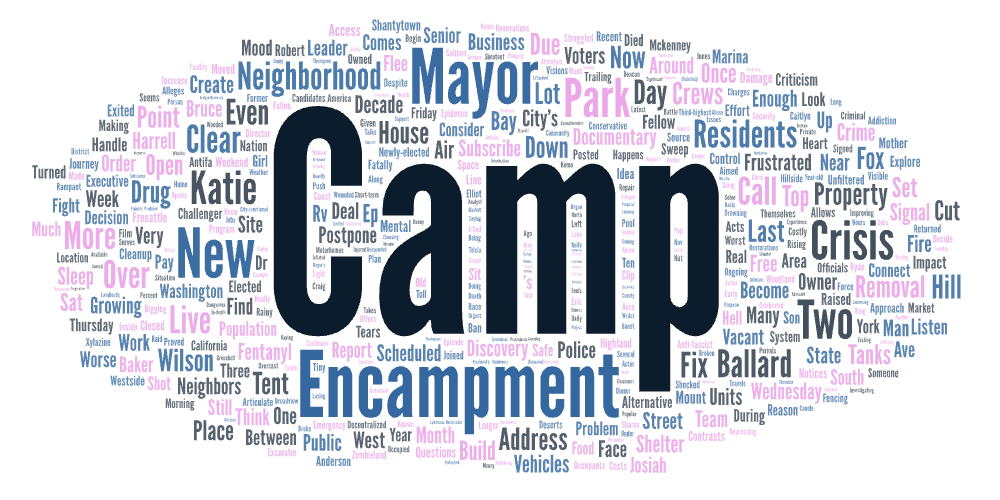
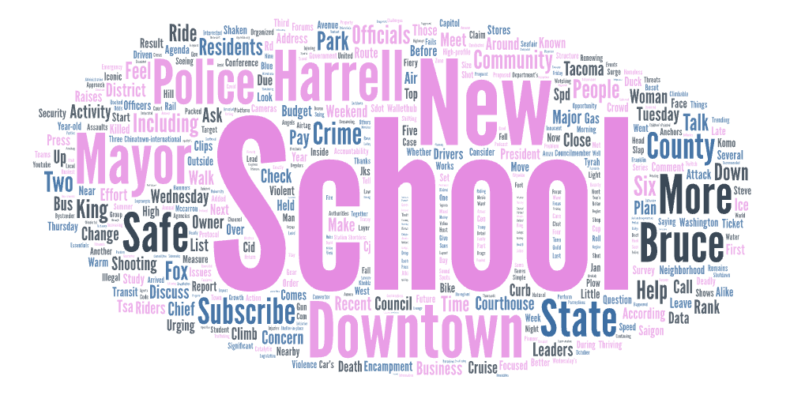

# Seattle public safety narratives on YouTube

I collected YouTube search results for three related queries:

- **seattle crime**
- **seattle safety**
- **seattle homeless**

The idea was to see how different wording (crime vs safety vs homeless) changes what shows up on YouTube and what language appears in the snippets.

I used a web crawler to compare three keyword sets on YouTube related to Seattle: seattle crime, seattle safety, and seattle homeless. I chose this comparison because while all three terms superficially discuss public safety, they carry distinct narrative frameworks. Crime tends to focus attention on incidents, conflicts, and law enforcement. Safety leans more toward a lifestyle perspective of security and advice. Meanwhile, homeless readily shifts the conversation toward social governance, public resources, and value conflicts. The word cloud comparisons reveal stark differences. The seattle crime word cloud features high-frequency terms associated with event-driven reporting—words like violence, arrests, suspects, and cases—creating a narrative reminiscent of news bulletins or surveillance footage: what happened where, who was arrested, and how severe the incident was. The Seattle homeless word cloud resembles a governance scene, featuring terms linked to encampments, cleanups, crises, municipal actions, and community conflicts. It emphasizes how public spaces are managed, policies are enforced, and residents' attitudes. In contrast, Seattle safety often occupies a middle ground. While it also connects with words like downtown, community, and police, its overall tone leans more toward discussion rather than explosive coverage of isolated incidents.

I believe at least two factors underlie these patterns. First, keywords filter content types: crime tends to push local news and law enforcement channels to the forefront; homeless often surfaces policy debates, cleanup operations, or community tensions. Safety, meanwhile, may blend news, personal experiences, and city impression videos. Second, the platform's algorithm amplifies attention-grabbing headlines and narratives. Consequently, emotionally charged or conflict-driven expressions become concentrated in search results, further skewing the word cloud toward more polarized themes.

To improve this study, I would first strengthen the sample by increasing the number of crawls and repeating them across different dates or time periods to assess word cloud stability. Additionally, text cleaning should be systematized to filter out noise words. Beyond relying solely on word clouds, more rigorous textual analysis methods should be incorporated.

What surprised me most was how changing just one search term instantly transformed YouTube's portrayal of Seattle. Searching with crime yielded results resembling a collection of breaking incidents, emphasizing conflict, cases, and law enforcement. Switching to homeless transformed the city into a battleground of governance disputes, with discussions centered on encampments, policies, and the tug-of-war over public spaces. Only safety came close to the more everyday, life-oriented security discussions I had initially imagined. This made me realize that a platform's search results don't merely mirror reality; they also filter and rank content through the frameworks embedded in keywords, amplifying certain narratives and thereby shaping our first impressions and intuitive judgments of a city.

## Word clouds

### Seattle crime

### Seattle homeless

### Seattle safety

## Download the CSV results

- [seattle-crime.csv](assets/seattle-crime.csv)
- [seattle-safety.csv](assets/seattle-safety.csv)
- [seattle-homeless.csv](assets/seattle-homeless.csv)
